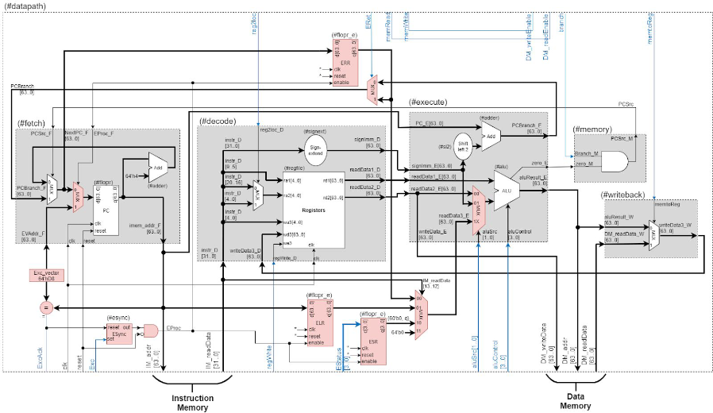

**Arquitectura de Computadoras 2020**

**Práctico N° 3: Procesador de un ciclo con excepciones**

El  objetivo  de  este  práctico  es  aplicar  los  conceptos  aprendidos  de  Excepciones  e Interrupciones de E/S y dotar a nuestro procesador de un ciclo (construido y probado en los prácticos 1 y 2) de los recursos necesarios para procesar una excepción, tanto por eventos propios de la CPU, como un evento de interrupción de E/S. Las Fig. 1 y 2 muestran una posible  implementación  propuesta,  donde  los  bloques  agregados  o  modificados  están resaltados en color rojo. Es **MUY IMPORTANTE** realizar este práctico en un nuevo proyecto en System Verilog a partir del código del procesador de los prácticos 1 y 2, **UNA VEZ QUE ESTOS  ESTÉN  CONCLUIDOS  Y  CON  EL  FUNCIONAMIENTO  CORRECTO COMPROBADO.**  

Todos los recursos nuevos del *datapath* se deben implementar en un nuevo módulo llamado *#exception* (con excepción de los dos MUX agregados en los módulos *#fetch* y *#execute*), respetando los nombres de las figuras*.* El diagrama no contiene este nuevo módulo para facilitar la visualización de las modificaciones y su funcionamiento. Vale aclarar que este nuevo proyecto NO será utilizado como base para futuros desarrollos.

Figura 1: Top Level ARM processor

Figura 2: Datapath ARM processor**

**Ejercicio 1: Creación de nuevos módulos**

Para la implementación del esquema dado será necesario la creación de algunos módulos. Se debe escribir el código en SystemVerilog de los siguientes bloques:

1) #flopr\_e: a partir del código de #flopr, modificar el código de tal forma de agregar una entrada *enable* al módulo. De esta forma el registro solo actualiza el valor de su salida con el valor de la entrada solo si la entrada *enable* = 1. Caso contrario no se realiza ninguna acción.
1) #mux4: Se debe crear un nuevo módulo llamado #mux4, cuyo comportamiento sea el de un multiplexor de cuatro canales de entrada de N bits de ancho y una entrada de selección de dos bits. Los cuatro canales de entrada deben denominarse d0, d1, d2 y d3 respectivamente, la entrada de selección debe llamarse "s[0..1]" y la salida "y".
1) #ESync: Es un bloque que sincroniza los eventos de excepción del microprocesador. Su funcionamiento puede sintetizarse de la siguiente forma:
   1. La salida OUT debe valer ‘1’ ante un flanco ascendente de la entrada set
   1. La salida OUT debe valer ‘0’ ante un flanco ascendente de reset
   1. Sin cambios en OUT para cualquier otro evento de entrada.
1) #comp\_n: Circuito combinacional que compara dos números de N bits c/u. Si ambos números son iguales la salida es ‘1’, caso contrario, ‘0’.

Es importante realizar el test bench correspondiente de cada módulo a fin de comprobar su correcto funcionamiento.

**Ejercicio 2: Modificaciones en el Datapath**

A partir del proyecto del procesador de un ciclo de los prácticos 1 y 2, realizar todas la modificaciones en los módulos correspondientes mostrados en las Fig. 1 y 2 de esta guía. Para ello es necesario crear un nuevo módulo denominado *#exception* donde se deben instanciar  los módulos creados en el ejercicio 1 (*#flopr\_e, #mux4, #ESync, #comp\_n*) y realizar las conexiones correspondientes en el módulo *#datapath.*

A TENER EN CUENTA:

- El bloque *Exc\_vector* no debe ser implementado como tal, ya que solo representa el valor constante de la dirección donde se ubica el vector de interrupciones. El vector de  interrupciones  debe  apuntar  a  la  instrucción  54,  de  esta  forma  tenemos disponibles 10 instrucciones para el proceso de interrupciones y excepciones. Las entradas conectadas a este bloque deben ser reemplazadas por la constante en 64 bits: 216 (64’hD8) . Esta constante resulta de multiplicar las 54 instrucciones por las 4 palabras de memoria que ocupa cada una de ellas.

**Ejercicio 3: Modificaciones en el Controller**

Introducir  las  modificaciones  en el código SystemVerilog del módulo *#maindec* a fin de agregar a la ISA de nuestro procesador dos instrucciones nuevas: ERET y MRS. Luego, realizar las conexiones necesarias en los módulos *#controller* y *#processor\_arm*.

1) **ERET** (Exception Return) ERET

Tipo: R

OpCode: 1101011\_0100

|31                                        21 |20            16 |15                10 |9               5 |4               0 |
| - | - | - | - | - |
|**opcode** |**Rm** |**shamt** |**Rn** |**Rd (Rt)** |
|1 1 0 1 0 1 1 0 1 0 0 |1 1 1 1 1 |0 0 0 0 0 0 |1 1 1 1 1 |0 0 0 0 0 |
2) **MRS** (Move (from)SystemReg to GeneralPurposeReg)  MRS <Rt>, <systemReg>  

Tipo: S (nuevo)

OpCode: 1101010100(1)

<systemReg> = “S<2+op0>\_<op1>\_<CRn>\_<CRm>\_<op2>”

- S2\_0\_C0\_C0\_0 → ERR → (CRn = “0000”)
- S2\_0\_C1\_C0\_0 → ELR → (CRn = “0001”)
- S2\_0\_C2\_C0\_0 → ESR → (CRn = “0010”)
- S2\_0\_C3\_C0\_0 → Reservado → (CRn = “0011”)

|31                                      21 |20  19 |18    16 |15         12 |11         8 |7       5 |4              0 |
| - | - | - | - | - | - | - |
|**OpCode** |**op0** |**op1** |**CRn** |**CRm** |**op2** |**Rt** |
|1 1 0 1 0 1 0 1 0 0 1 |1 X |X X X |X X X X |X X X X |X X X |X X X X X|
**Funcionamiento del bloque #maindec:**

A continuación se resume en la siguiente tabla el estado de todas las señales de control en función de las instrucciones. Las modificaciones respecto al procesador original se encuentran resaltadas en color rojo. Las ‘X’ representan condiciones sin cuidado, mientras que el símbolo ‘-’ representa que no debe tomarse ninguna acción.

|**Instruct** |**reg2 loc** |**ALUSrc [1..0]** |**Mem toReg** |**Reg Write** |**Mem Read** |**Mem Write** |**Branch** |**ALU Op[1..0]** |**EStatus [3..0]** |**ERet** |**Exc** |
| - | - | - | :- | :- | :- | :- | - | :- | - | - | - |
|R-type |0 |**00** |0 |1 |0 |0 |0 |10 |**0000** |**0** |**0** |
|LDUR |X |**01** |1 |1 |1 |0 |0 |00 |**0000** |**0** |**0** |
|STUR |1 |**01** |X |0 |0 |1 |0 |00 |**0000** |**0** |**0** |
|CBZ |1 |**00** |X |0 |0 |0 |1 |01 |**0000** |**0** |**0** |
|**ERET** |**0** |**00** |X |0 |0 |0 |1 |01 |**0000** |**1** |**0** |
|**MRS** |**1** |**1X** |0 |1 |0 |0 |0 |01 |**0000** |**0** |**0** |
|**(\*1)** |**X** |**XX** |0 |0 |0 |0 |0 |XX |**0010** |**0** |**1** |
|**(\*2)** |**-** |- **-** |**-** |**-** |**-** |**-** |**-** |- **-** |**0001** |**-** |**1** |
Otras modificaciones:

- Cuando en el bloque #control ingresa un **opcode invalido**, se debe poner a ‘1’ una señal interna llamada ***NotAnInstr*** y el resto de las señales de control deben tomar los valores indicados en la tabla, correspondientes a la fila denotada con **(\*1)**.
- Ante la ocurrencia de una flanco ascendente en ***ExtIRQ*** las señales de control deben permanecer sin cambios, con excepción de las señales ***EStatus*** y ***Exc*** que deben tomar los valores de la tabla, correspondientes a la fila denotada con **(\*2)**.
- **ExtIAck** debe ser ‘1’ cuando *ExcAck*** = ‘1’ y *ExtIRQ = ‘1’, caso contrario debe valor ‘0’*
- La salida **Exc** debe ser el resultado de una operación OR entre la entrada *ExtIRQ* y la señal *NotAnInstr**.***
- Agregar la entrada **reset**, cuando esta vale ‘1’ todas las salidas del bloque deben valer ‘0’.

El módulo *#alu\_control* **NO** sufre modificaciones en su funcionamiento, solo debe corroborarse que las nuevas instrucciones sean procesadas de la misma forma que la instrucción CBZ.

|**Instruction** |**ALUOp** |**Instruction Op** |**OpCode field** |**ALU Action** |**ALU Control** |
| - | - | - | - | - | :- |
|CBZ **ERET MRS** |01 |Comp & branch on Z  **ERET o MRS** |XXXXXXXXXXX** |Pass input b |0111 |
**Ejercicio 4: TestBench**

Escribir el módulo TestBench en System Verilog para corroborar el correcto funcionamiento del tratamiento de las excepciones. El procedimiento debe, además de permitir la ejecución de un programa en Assembler LEGv8, generar un pulso sobre la señal *ExtIRQ* y corroborar el procesamiento de la interrupción mediante el assert de la señal *ExtIACK* en el siguiente ciclo de CLK. Recordar que el código del vector de excepción debe estar ubicado en la instrucción número 54 (.org 0xD8) de la memoria de instrucciones.

El programa de assembler debe ser escrito sobre el archivo template <main.s> disponible en la sección de la guía 3 del aula virtual. Este programa debe contener una secuencia de prueba  que  denote  el  correcto  funcionamiento  de  todas  las  instrucciones  del microprocesador, (LDUR, STUR, CBZ, ADD, SUB, AND, ORR, incluidas ERET y MRS). Para esto, se debe modificar el programa dado en el ejercicio 4 del práctico 1, de forma en que  se  cuente  en  el  registro  X30  el  número  de  interrupciones  externas  que  ingresan (recuerden previamente inicializarlo en cero). Además, en alguna parte del código debe agregarse  una  instrucción  para  que  contenga  un  opcode  no  válido  y,  mediante  el TestBench, se debe hacer ingresar al menos una interrupción externa (en algún momento distinto a la instrucción no válida). Luego, en el vector de excepciones se debe verificar si la excepción se debe a una interrupción externa o a una instrucción válida y actuar en forma diferente. En caso de que llegue una instrucción no válida debe saltarse esa instrucción y continuar con el flujo normal del programa, en caso en que llegue una instrucción externa se debe incrementar el registro X30 y volver al flujo normal del programa.

Se  recomienda  agregar  un  bucle  infinito  de  forma  en  que  puedan  ingresar  varias interrupciones externas y que este no contenga la instrucción no válida.

**Aclaración:** Cada vez que se desea realizar una interrupción externa, se debe poner en ‘1’ la  entrada  ExtIR  durante  el  tiempo  que  dura  un  ciclo  de clock, sin embargo, no debe coincidir con el flanco ascendente de clock, debe estar desfasada.

A TENER EN CUENTA:

- Para obtener el código ensamblado en hexadecimal, se debe escribir el programa a implementar en el archivo <main.asm>, y luego escribir por terminal:

$ make

y copiar en el módulo **imem** las instrucciones generadas en “main.list”, respetando el formato del ejercicio 4 de la guia 1.

*Nota:* verificar que se tiene instalada la toolchain de aarch64, caso contrario escribir:

$ sudo apt install gcc-aarch64-linux-gnu

- Antes de comenzar, verificar que los registros X0 a X30 estén inicializados con los valores deseados del módulo **regfile**.
